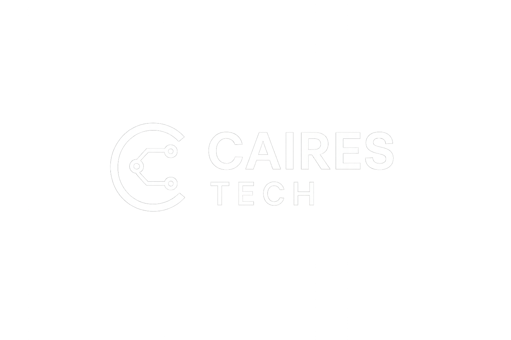

# 📁 Caires Tech Projects



Este repositório reúne todos os projetos desenvolvidos durante minha
jornada de estudos em HTML, CSS e JavaScript.\
Cada projeto tem o objetivo de treinar lógica de programação,
manipulação do DOM e práticas de desenvolvimento web.

## 🚀 Projetos incluídos

### 🔢 Calculadora Simples

Uma calculadora básica feita em HTML, CSS e JavaScript.

🔗 Acessar: `Calculadora Simples/index.html`

------------------------------------------------------------------------

### 💰 Calculadora de Gorjeta

Ferramenta para calcular o valor da gorjeta com base no valor da conta.

🔗 Acessar: `Calculadora Gorjeta/index.html`

------------------------------------------------------------------------

### 🎯 Jogo Adivinhe o Número

Jogo interativo onde o jogador deve adivinhar o número secreto.

🔗 Acessar: `Adivinhe o Número/index.html`

------------------------------------------------------------------------

## 🖥️ Página Principal

Inclui: - Tema dark - Título animado - Botões responsivos - Logo com
efeito neon via CSS

------------------------------------------------------------------------

## 🛠️ Tecnologias Utilizadas

-   HTML5\
-   CSS3\
-   JavaScript\
-   Git & GitHub\
-   GitHub Pages

------------------------------------------------------------------------

## 📄 Como executar localmente

``` bash
git clone https://github.com/caires-tech/SEU-REPO.git
cd SEU-REPO
```

Abra o arquivo `index.html` no navegador.

------------------------------------------------------------------------

## 📢 Sobre mim

Sou Rodrigo Caires, migrando para a área de tecnologia e desenvolvimento
full stack.\
Este repositório representa minha evolução passo a passo.
